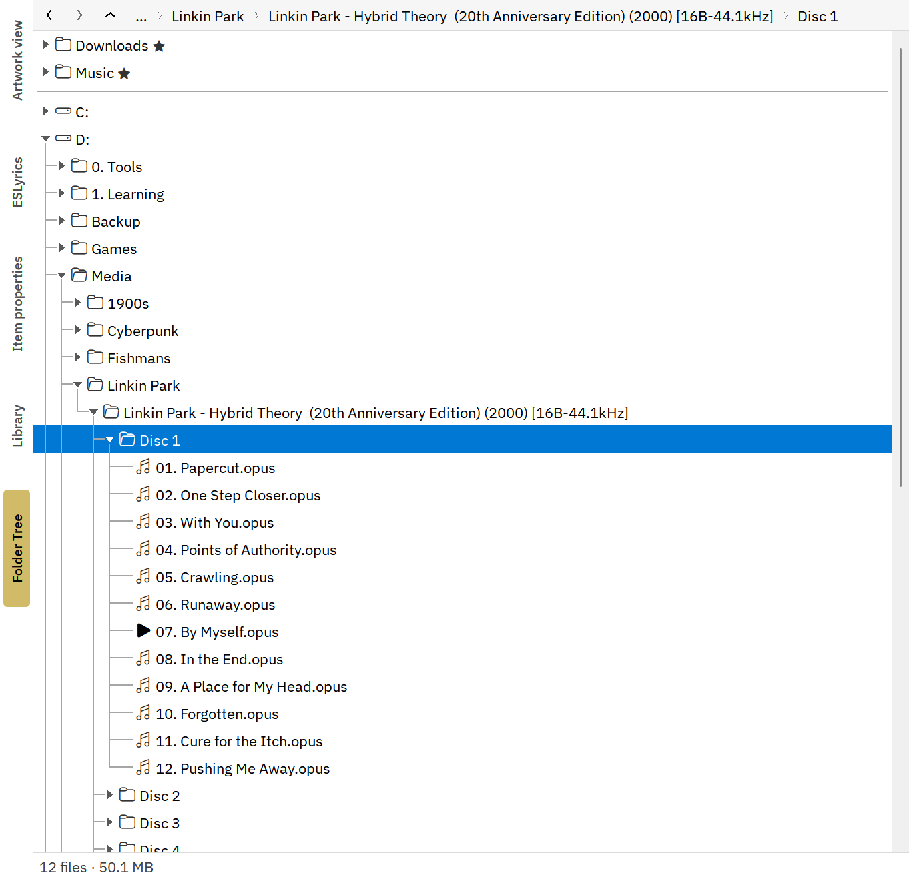
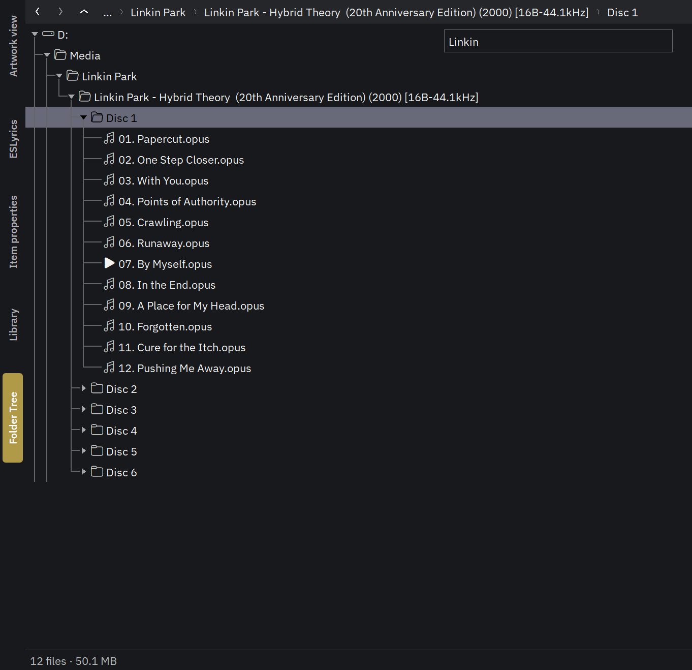

<h1 align="center">Folder Tree (foo_filetree)</h1>

  A fast folder tree panel for <a href="https://www.foobar2000.org/">foobar2000</a> v2, for
  Default UI and Columns UI.

<table>
  <tr>
    <td width="50%" align="center"> Light theme: favourites, tree lines, the playing track</td>
    <td width="50%" align="center"> Dark mode: the filter box narrowing the tree</td>
  </tr>
</table>

## Features

- **Drives, favourite folders and files, and your Media Library folders** as roots. Folders
  are read in the background, so a slow, sleeping or offline drive never freezes foobar2000.
- **Less clutter**: hide system folders (Windows, Program Files and the like are hidden by
  default) and folders with no playable files in them.
- **Stays current.** Open folders update by themselves when files change on disk.
- **Your clicks, your actions.** Single, double and middle click and Enter each have their own
  action for folders and for files: play, add to the active playlist, send to a new playlist,
  add to the playback queue, or nothing.
- **Explorer-style selection** (Ctrl, Shift, Ctrl+A). Playlist commands, copy, cut, delete,
  drag and the context menus act on all selected items.
- **File operations**: rename, delete to the Recycle Bin with undo, new folder, copy / cut /
  paste, drag and drop to and from Explorer.
- **Context menu** with foobar2000's track menu and the full Explorer menu. Reorder its items
  or hide the ones you don't use.
- **Address bar** with Back, Forward, Up, typed paths and a favourites drop-down, and a
  **filter box** that narrows the open folders as you type.
- **Search every drive** by name (optional, Ctrl+Shift+F): results fill in as they are found.
- **Now playing**: the playing track is marked, and the tree can follow it.
- **Your look**: icons, tree lines, sorting (natural order, by name, date, size or type),
  tooltips, row height, hover highlight, shaded rows, a thin scrollbar, a status bar with counts
  and sizes, and transparency. Colours, font and dark mode follow your Default UI or Columns UI settings.
- **Screen readers** can read and navigate the tree.
- **Light on resources**: nothing runs while nothing changes.

## Install

Requires foobar2000 v2 on Windows, 32-bit or 64-bit (the package contains both).

1. Download `foo_filetree.fb2k-component` from the
   [latest release](https://github.com/HongYue1/foo_filetree/releases/latest).
2. Double-click it, or in foobar2000 open **Preferences > Components > Install...**, and restart.
3. Add the panel: in Default UI, enable **View > Layout > Edit layout**, then right-click >
   **Replace UI Element... > Utility > Folder Tree**. In Columns UI, **Preferences > Display >
   Columns UI > Layout**, then add **Panels > Folder Tree**.

Settings are in **Preferences > Tools > Folder Tree**. Changes preview live and are kept when you
press OK or Apply.

## Keyboard and mouse

| Key / mouse | Action |
| --- | --- |
| Arrows, Home, End | Move; Right / Left also open and close folders |
| + / - | Open / close the folder |
| Page Up / Page Down | Go to the parent folder / the next folder after it |
| Letters | Jump to the next item starting with them (same letter again: next match) |
| Enter, double click | Run the action set for it (default: open a folder, play a file) |
| Middle click | Run the middle-click action (default: add to the active playlist) |
| Shift + Enter / middle click | Same, but flip "include subfolders" |
| Ctrl + Enter / middle click | Same, but send to the active playlist |
| Ctrl+click, Ctrl+Space | Add to or take out of the selection |
| Shift+click, Shift+arrows | Select a range |
| Ctrl+arrows | Move without changing the selection |
| Ctrl+A | Select all visible items |
| F2 | Rename |
| Del / Shift+Del | Delete to the Recycle Bin / delete permanently |
| Ctrl+Z | Undo the last rename or delete |
| F7 | New folder |
| Ctrl+C / Ctrl+X / Ctrl+V | Copy / cut / paste files |
| Ctrl+Shift+C | Copy the full paths |
| Alt+Enter | Properties |
| F5 | Refresh the open folders |
| Ctrl+L | Type a path in the address bar (environment variables like `%USERPROFILE%` work) |
| Ctrl+F | Filter box (Esc clears it) |
| Ctrl+Shift+F | Search every root by name, if turned on (Mouse & keys tab). Esc stops, Esc again closes |
| Alt+Left / Alt+Right / Alt+Up, mouse side buttons | Back / Forward / Up |
| Shift+right-click | Context menu with Explorer's extra commands (Copy as path, Open in Terminal, ...) |

**View > Folder Tree** in the main menu has Show now playing, Refresh, Collapse all and New
folder. Give them shortcuts in **Preferences > Keyboard Shortcuts**.

## Good to know

- **Drag and drop**: drag items to a playlist, a playlist tab or Explorer. Drop files on a folder
  to copy them there; hold Shift to move. Holding a drag over a closed folder opens it.
- **Favourites**: right-click a folder > **Add to favourites**. Favourites are shared by all
  Folder Tree panels; order or remove them on the Roots tab, where favourite files are listed
  below the folders. Right-click a file (any type: music, video, a PDF booklet, artwork) >
  **Add to favourites** and it shows under **Favourite files**. Files that are missing
  (deleted, or on a drive that isn't there) are left out until they're back. Select several
  items to add or remove them all at once.
- **Favourites drop-down**: right-click a favourite > **Add to favourites drop-down**. A button
  with a down arrow appears next to Up in the address bar; pick an entry to jump to it. You can
  also tick or untick it for the selected favourite on the Roots tab.
- **Read-only mode** (Mouse & keys tab): browse and play only. No rename, delete, cut, paste,
  new folder, undo or Explorer submenu, nothing can be dropped on the tree, and dragging out
  copies, never moves.
- **Filter box** filters what is open; it doesn't search the disk. `*` and `?` work (`*.flac`).
- **Search** (turn it on in Preferences > Mouse & keys) looks through every drive and favourite
  for names, using the same rules as the filter box and only what the tree would show (hidden
  files, file types and hidden folders as you set them). Press Enter to start. The tree then
  shows only the matches and the folders above them; play, drag and right-click them as usual.
  F5 searches again; Esc stops, a second Esc brings your tree back. Stops at 10,000 matches.
- **Undo** is one step and covers renames and deletes made in the panel. Shift+Del can't be
  undone.
- **Removable and optical drives** aren't watched for changes, so Safely Remove keeps working.
  Press F5 there after changes.
- **Which files show**: playable files only by default. On the Files tab, show all files or
  only folders, list extra extensions (`cue; log`), or hide names by pattern (`@eaDir; *.tmp`).
- **Each panel remembers** its open folders, selection and scroll position. On startup it can
  restore them, start closed, open a fixed folder or show the last played track.
- **Transparency** only shows something when your layout draws a background behind the panel.
- **Status bar** (General tab): counts and sizes of the selection, or of the focused folder.
- **Media Library folders**: tick "Also show the music folders" on the Roots tab. foobar2000
  has no way to ask for that list, so Folder Tree works it out from the library's tracks: a
  folder with no tracks in it yet doesn't show. The folders from last time show at once on
  startup.
- **Hidden folders** (Folders tab): right-click a folder > **Hide this folder**, or edit the
  list. `%WINDIR%` style variables work, and `?:\` stands for any drive.
- **Empty folders** (Folders tab): when hidden, folders are checked in the background, so one
  can show up for a moment before it goes away. A folder too big to check quickly stays.

## Building

Visual Studio 2026 with the C++ desktop workload and ATL, WTL 10 in `..\wtl`, and the foobar2000
SDK 2026-09-17 with the Columns UI SDK in `..\SDK-2026-09-17`.

- `build.bat [Release|Debug] [x64|Win32]` builds the DLL.
- `test\build_tests.bat` builds and runs the tests.
- `package.bat` builds both platforms into `dist\foo_filetree.fb2k-component` (PDBs in
  `dist\symbols`).

## License

[MIT](LICENSE)
